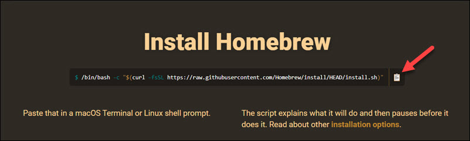

# 重新搭建我的个人网站

## 初心
计划重新搭建我的个人网站 https://www.liyonghua.com, 主要基于以下几点的考虑：
- 希望更新到vscode + github + markdown的工具技术组合，在写文档的时候也可以使用并熟悉这些技术。ps，这个组合使用起来实在在太香了。
- 原来blog的缺点：
    - 之前迁移过一次网站，但是文章格式丢失，而保持格式统一刚好是markdown的优点
    - 不想再在文章编辑过程中，浪费时间于格式和样式的编辑
    - 没有办法做专栏，而我计划学习 https://liaoxuefeng.com 开设一些专栏
- 在 https://gitsite.org，看到网站还支持book的类型，受到李笑来的启发https://github.com/xiaolai，也计划在github写书
- github才是互联网最可靠且能最长久记录数据的地方，最能体现互联网开源共享的精神，是互联网数据的最佳归宿

## 工欲善其事，必先利其器

### 在我的 MacOS 12.7上搭建gitsite
1. 由于 https://gitsite.org 推荐的是npm的安装，macOS上又需要先安装HomeBrew。
2. 在[Homebrew's official website](https://brew.sh/) 拷贝最新的安装命令并在终端运行。

3. 完成安装后，还需要在终端运行以下命令更新brew的repository：
    ```c
    brew update
    ```
4. 完成后，检查版本是否和[github](https://github.com/Homebrew/brew/releases/latest)上最新版本一致
    ```c
    brew --version
    ```
5. 继续安装NPM和node JS, update到最新版本并查看
    ```c
    brew install node
    brew upgrade node
    node -v
    npm -v
    ```
6. 此时可以在终端运行命令安装gitsite:
    ```c
    npm install -g gitsite-cli
    ```
7. 此时本地新建好一个空的文件夹，开始安装gitsite：
    ```c
    npm install -g gitsite-cli
    cd /Users/yonghua/Documents/repos/gitsite
    gitsite-cli init
    ```
8. 安装完之后，启动gitsite的服务，然后通过本地浏览器访问 http://localhost:3000/ 。这里需要注意的是，服务启动可能需要比较久的时间，导致我当时浪费不少时间查各种可能的问题。
    ```c
    gitsite-cli serve
    ```
9. Mac上的几个DS_Store的文件，git显示这些文件未被track。今天在当前repo的根目录添加.gitignore的文件，添加各类需要git ignore的文件类型，最终直接copy使用xuefeng的这个文件即可，非常详细的列出了各种文件。
10. 下一步： 如何在本地更新文章后，可以同步到这个静态的网站 - 在本地提交git之后，就直接生效了。


### 我的 CentOS 7 Server
1. centOS 7 版本太老，需要升级到centOS 9，在此之前先把之前的网站和服务进行备份。


## 步骤


