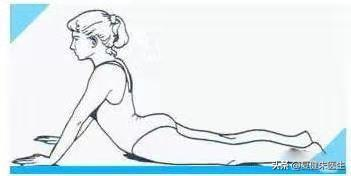
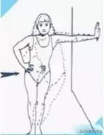
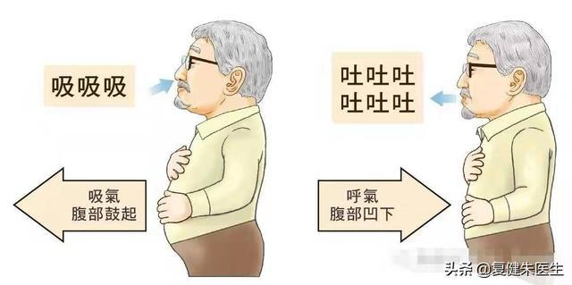
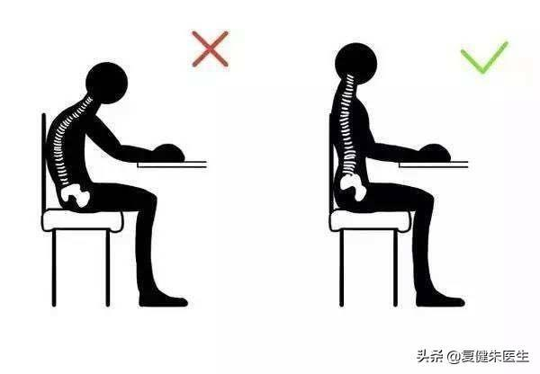
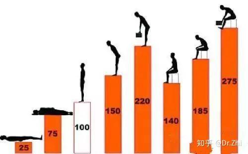

# 主题研究：腰椎间盘突出

### 要解决的问题
- Why: 剖析自己为什么得病
- What: 腰椎间盘突出到底是什么
- How: 如何康复和缓解，日常生活需要注意哪些 （还可以健身吗？）
- Next: 我后续的执行计划是什么

### 泛读-资料收集，建立基本概念
- **丁香医生 腰椎间盘突出症**： https://dxy.com/disease/3510/detail
    - **摘要1: 腰椎间盘突出症突出的椎间盘能自行消失或缩小吗？**
        - 一般来讲，有一部分人突出的椎间盘能够自行吸收或缩小。突出的椎间盘大部分和完全被吸收者，一般此类患者年龄较小，发病时间也较短。如果突出的椎间盘发生钙化、骨化的情况，它就不能被吸收或自己缩小了，该种情况下一般需要手术治疗。
    - **摘要2: 腰椎间盘突出症有哪些常见病因？**
        - 本病的病因明确，主要有以下几个方面:
        - 椎间盘退变：是年龄增长的过程中必然会发生的一个改变，再加上外力和劳损的原因，更容易发生本病。
        - 损伤：反复弯腰、长时间久坐造成的积累性损伤容易引起本病。
        - 妊娠：妊娠妇女由于韧带松弛的缘故，更容易发生本病。
        - 遗传因素：部分青少年有腰椎间盘突出症家族史，可能会遗传。
        - 发育异常：如关节不对称，下腰椎承受过大的压力，而易发本病。
    - **摘要3: 腰椎间盘突出症有哪些治疗方法？**
        - 整体来说，腰椎间盘突出的病人大部分还是采用保守治疗的方式。
        - 保守治疗的方法有多种多样，包括休息、牵引治疗、按摩、药物治疗等。根据病人的不同情况选择：
            - 首先卧床休息是最基本，也是最重要的基本治疗。因为椎间盘在正常生活里面，起到支撑体重的作用，在直立或者坐着的时候，椎间盘要承担很大的重量，这时候里面的压力很高，对神经根产生的压迫相应比较重。大部分人也不是很重的腰椎间盘突出，比如说膨出，通过卧床，整个脊柱完全的放松了，椎间盘的压力减轻，它对神经根的挤压就减轻了。同时有的病人椎间盘压迫了神经根以后，神经根本身会有些炎症，你卧床休息以后，椎间盘压力轻了以后，神经这些肿胀就会慢慢减退，实际上也达到治疗的目的。
            - 如果说保守治疗解决不了，就要寻求一些其他的方法。
            - 某些药物也可以起到比较好的作用， 这些药物主要就是针对炎症反应的，减轻神经根的水肿，减轻局部的炎症反应，通过这些措施来起到缓解疼痛的作用。
            - 再就是手术治疗，依据不同病情，可选择不同手术方式。
    - **摘要4: 腰椎间盘突出的手术治疗都有哪些？**
        - 常用手术有以下几种，具体采用哪种情况，需要医生根据突出的情况来判断：
        - 经腹腰椎间盘切除术：能很好显露出椎间隙，不损伤背部肌肉，可以比较完整得切除整个椎间盘，但创伤比较大，需要较长时间恢复，临床使用并不多。
        - 显微椎间盘切除术：在显微镜下，切开椎旁组织进行操作，可以缩短患者住院时间。
        - 经椎间孔镜下椎间盘摘除术：从患者的侧方进入椎间孔实施手术，创伤较小，出血少，是效果较好的微创手术。
    - **摘要5: 牵引治疗能彻底治好腰椎间盘突出症吗？**
        - 通过牵引不能彻底治好腰椎间盘突出症，对于其作用效果还缺少缺乏高质量的医学支持。
        - 牵引属于理疗，只是暂时缓解临床症状，减轻椎间盘内压力。
    - **摘要6: 腰椎间盘突出症患者做推拿按摩能把椎间盘按回去吗？**
        - 不能。
        - 该方法可使痉挛的背部肌肉松弛，可以缓解甚至消除症状，但是并不能把突出的椎间盘按回去。
    - **摘要7: 腰椎间盘突出症在家里可以做哪些训练？**
        - 若症状还在急性期，如刚出现 1～2 天，或症状非常剧烈，建议先行休息适当保持不会引起疼痛的活动，并根据情况考虑服用消炎止痛的药物帮助症状减轻，再进行相应的康复训练。
        - 当症状随休息有所减退后，可以在无痛的情况下，尝试以下措施帮助进一步缓解症状（但若有任何症状加重或无效，建议立即停止进行并考虑就医评估）：
            - 站立位躯干侧移纠正 练习目的：纠正姿势的异常，避免不良姿势影响进一步恢复和引起后续其他问题。 动作链接：站立位躯干侧移纠正
            - 俯卧 mckenzie 伸展保持/重复 练习目的：帮助进一步减轻症状，若症状逐渐由远及近改变，则说明该练习有效。 动作链接：俯卧mckenzie伸展
    - **摘要8： 腰椎间盘突出可以做什么运动减少复发？**
        - 腰椎间盘突出通常会和活动时核心控制不足有关，因此需要核心稳定的练习和全身性的有氧运动参与提高我们身体机能。
        - 动作名称：四点跪位抬手/抬腿核心稳定练习 练习目的：提高核心区域的稳定控制能力，帮助姿势管理，本姿势下脊柱压力较小，适合疼痛较明显的患者进行
        - 有氧运动（轻量） 练习目的：提高身体整体机能，改善身体的耐受能力、自我调整能力和心情，降低对于疼痛的过度敏感。
            - 练习内容：在不引起疼痛加剧的情况下，选择适合自己的练习方式，如快步走、自行车、游泳、跳绳、跑步等，通常以 15～30 分钟为宜。
        - 由于每个患者的情况都有特定的差异性，相比自己进行康复，康复师指导下的康复会更加精细化，根据患者的情况和所处的阶段，按需进行手法治疗和康复训练，并给予充分的指导保证症状的持续减退直至消失，降低复发的概率。
    - **摘要9: 怎么锻炼可以缓解腰突症状？**
        - 腰椎间盘突出症患者首先应当就医，采取相应治疗。如果医生建议多锻炼肌肉力量，则可以通过下面两个康复训练来增加肌肉力量，减轻腰背部疼痛。
            - 臀桥
            - 猫式伸展
- **腰椎间盘突出久治不愈？听听治疗师的5步治疗法** https://zhuanlan.zhihu.com/p/97895740
    - **摘要1: 我们通过麦肯基两个动作来自我改善和矫正：**
        - 起身运动，上半身如图所示，保持髋关节紧贴地面，保持下腰部及臀部放松，纠正腰椎曲度变直
        
        - 靠墙牵伸，一次上肢支撑墙面，另一侧上肢辅助髋关节向墙面缓慢运动
        
    - **摘要2: 让腰椎附近的肌肉，来维持它的稳定。**
        - 近几年，研究发现：呼吸，尤其是膈肌呼吸对于我们腹横机以及我们整个的核心力量具有很好的效果。研究表现其实腰围并不是基于肌肉的一个支撑而维持腰椎的稳定，而是由于腰围的压力能够增加我们的腹内压，从而维持腰椎的稳定。呼吸可以有效的激活腹部的核心力量，增加腹内压，维持腰椎的稳定。
        - 方法：患者仰卧位，屈髋屈膝，吸气时，肚子以及腹部两侧鼓起，呼气时，肚子及两侧收缩，如图：
        
    - **摘要3:日常注意**
        - 注意日常坐姿如图：
        
        - 平时各个动作对腰椎的压力，以直立时腰椎压力为100:
        
- https://zhuanlan.zhihu.com/p/342980075
    - 摘要1: 7步麦肯基训练法详解

### 是否还能够去健身房：
以下由AI生成： 
1. 可进行的健身房锻炼
    - 低冲击有氧运动
        - 游泳：水的浮力可减轻脊柱压力，自由泳或仰泳姿势更适合，避免蝶泳等高强度动作。
        - 静态自行车：调整座椅高度至膝关节微屈状态，减少腰部震动，建议每周2-3次，每次30分钟。
    - 核心肌群训练
        - 平板支撑：保持身体成直线，收紧核心肌群（腹肌、背肌），每次30秒至1分钟，逐步延长时间。
        - 鸟狗式（四点跪位交替抬手脚）：增强脊柱稳定性，每组8-12次，注意保持腰椎中立位。
        - 臀桥：仰卧抬臀强化臀部和下背部肌肉，每组10-15次，避免腰部代偿发力。
    - 轻量力量训练
        - 上肢训练：如坐姿推胸、高位下拉等，避免涉及腰部负重的器械（如坐姿划船需谨慎）
        - 弹力带训练：通过抗阻动作增强肌肉力量，减少对腰椎的压力。
2. 需严格避免的健身房项目
    - 高负荷力量训练
        - 深蹲、硬拉：这些动作会增加椎间盘纵向压力，可能加重突出症状。
        - 举重、倒蹬机：器械负重易导致腰椎瞬间高压，诱发疼痛。
    - 快速扭转或过度屈伸动作
        - 仰卧起坐、卷腹：弓背动作会挤压椎间盘，增加纤维环破裂风险。
        - 瑜伽高难度体式（如桥式、大幅度扭转）：可能过度牵拉腰椎，导致神经压迫加重。
    - 球类运动（如羽毛球、网球）：快速转身动作对腰椎稳定性要求高，易造成损伤。
    - 其他高风险动作
        - 站姿俯身够脚尖：弯腰时腰椎负荷骤增，可能引发急性疼痛。
        - 倒走：协调性差的患者易摔倒，加重病情。
3. 锻炼原则与注意事项
    - 急性期禁止锻炼
    - 疼痛发作期需卧床休息，仅可进行散步等轻量活动，待症状缓解后再逐步恢复锻炼14。
    - 单次训练时长不超过50分钟，力量训练负重不超过自身体重20%，心率维持在最大值的60%-70%。
    - 所有动作需保持脊柱中立位，避免塌腰或圆背，必要时佩戴腰围提供支撑。
    - 训练前进行10分钟动态拉伸（如猫牛式），激活髋关节和胸椎灵活性；训练后使用泡沫轴放松梨状肌和髂腰肌。
    - 若锻炼中出现下肢放射痛或腰痛加重，立即停止并咨询医生，调整训练计划。
4. 替代方案与日常维护
    - 居家锻炼：如小燕飞、五点支撑法等，可增强腰背肌力。
    - 生活习惯调整：保持BMI正常范围，使用中等硬度床垫，避免久坐，每30分钟起身活动。
    - 综合治疗：结合理疗、针灸等，必要时遵医嘱使用药物或手术干预。
5. 总结：腰间盘突出患者可谨慎选择健身房锻炼，但需以低冲击、核心强化为主，严格规避高风险动作，并在专业指导下制定个性化计划。坚持科学训练结合日常防护，才能有效缓解症状并预防复发。本回答由 AI 生成，内容仅供参考，请仔细甄别。

### 自我反思
1. 为什么会得病？
    - 长时间久坐：包含上班时间和回家电脑前的时间
    - 回家后的姿势，尤其不正确
    - 作息不规律，导致坐的时间超长
    - 健身房做深蹲等腿部动作训练
2. 这个病对我来说意味着什么？
    - 以后腰部无法发力了
    - 腰部需要长期的好好保养
    - 坐一会就要站起来
3. 后续的计划
    - 早睡早起，床上待满8小时
    - 给自己设置定时站起来的闹钟
    - 每天在床上做恢复性的动作
    - 健身计划，每周去2次，做有氧即可
    - 减肥：
        - 想办法在公司完成晚饭，尽量早吃晚饭
        - 晚上不吃零食，晚上就只可以喝牛奶
        - 中午要多走，每天争取6000步

### 时间建议安排 by AI
- 6:30-7:00 起床与晨间准备
    - 起床动作：侧身用手臂支撑缓慢起身，避免直接仰卧起坐。
    - 晨间伸展（5分钟）：
    - 猫牛式（跪姿脊柱屈伸）：激活腰背肌肉。
    - 仰卧抱膝滚动：缓解晨间僵硬（需在硬床或瑜伽垫完成）。
    - 热敷或暖水浴（可选）：促进血液循环，缓解肌肉紧张。
- 7:00-7:30 早餐
    - 饮食建议：
    - 高蛋白（鸡蛋、豆浆）+ 富含钙/维生素D（牛奶、坚果）+ 膳食纤维（燕麦、蔬菜）。
    - 避免过饱，减少腰部负担。
- 7:30-8:00 康复训练
    - 核心强化训练（20分钟）：
    - 死虫式（仰卧交替抬手抬腿）：激活深层核心肌群。
    - 鸟狗式（四点跪姿交替伸展对侧手脚）：提升脊柱稳定性。
    - 臀桥（保持5秒，10次）：强化臀肌与下背部。
    - 注意：全程收紧腹部，避免腰部代偿，疼痛时立即停止。
- 8:30-12:00 工作时间（每1小时穿插休息）
    - 办公姿势：
    - 使用人体工学椅，腰后垫小枕头保持腰椎前凸。
    - 电脑屏幕与眼睛平齐，双脚平放地面，膝盖略高于髋部。
    - 每小时活动（5分钟）：
    - 站立伸展：双手扶墙做“婴儿式”背部拉伸。
    - 散步或靠墙静蹲（30秒-1分钟）：减轻椎间盘压力。
    - 避免动作：久坐超过1小时、弯腰搬重物、突然扭转腰部。
- 12:00-13:00 午餐与午休
    - 饮食建议：清淡为主，避免辛辣刺激（减少炎症风险）。
    - 午休姿势：
    - 可仰卧于硬板床/地垫，膝盖下垫枕头（减轻腰椎压力）。
    - 时间不超过30分钟，避免长时间平躺加重僵硬。
- 13:00-13:30 冥想与呼吸训练
    - 正念冥想（15分钟）：
    - 坐姿：直背椅+腰部支撑，闭眼专注呼吸，想象气流进入脊柱区域。
    - 目标：缓解压力（心理压力可能加剧疼痛感知）。
    - 腹式呼吸练习（5分钟）：鼻吸口呼，激活腹横肌，增强核心控制。
- 14:00-17:30 工作时间（同上午节奏）
    - 下午加餐（15:00左右）：补充钙质（酸奶、奶酪）和抗氧化水果（蓝莓、樱桃）。
    - 活动升级：下午可增加一次“麦肯基疗法”动作（如俯卧肘撑，每次30秒，3组）。
- 18:00-18:30 有氧运动
    - 低冲击运动选择：
    - 游泳（首选自由泳或仰泳，避免蛙泳蹬腿）。
    - 散步（速度适中，穿戴支撑性跑鞋）。
    - 固定自行车（调高车座，身体微后倾）。
    - 时长：20-30分钟，以轻微出汗、无疼痛为限。
- 19:00-19:30 晚餐
    - 饮食建议：
    - 优质蛋白（鱼肉、豆腐）+ 深色蔬菜（菠菜、西兰花）+ 抗炎食材（姜黄、深海鱼油）。
    - 控制体重，避免肥胖加重腰椎负担。
- 20:00-20:30 晚间康复训练
    - 放松与柔韧性训练：
    - 骨盆时钟（仰卧缓慢转动骨盆）：改善腰椎灵活性。
    - 梨状肌拉伸（仰卧抱膝向对侧倾斜）：缓解坐骨神经压迫。
    - 泡沫轴放松臀肌与大腿后侧（每侧2分钟）。
- 21:00-21:30 读书/学习
    - 姿势建议：
    - 使用书架或电子书支架，保持视线水平。
    - 可选择侧卧读书（双腿间夹枕头），单次不超过20分钟。
- 21:30-22:00 睡前准备
    - 热敷：用40℃左右热敷袋敷腰部10-15分钟（急性期疼痛禁用）。
    - 渐进式肌肉放松：仰卧，从脚趾到头部逐步收紧-放松肌肉。
    - 睡姿调整：
    - 最佳姿势：侧卧，双腿间夹枕头，脊柱保持中立位。
    - 次选姿势：仰卧，膝盖下垫高10-15cm。
- 22:30 入睡
    - 睡眠时长：保证7-8小时，深度睡眠促进椎间盘修复。
    - 床垫选择：中等偏硬（可参考棕垫或高密度记忆棉），避免过软导致腰椎下陷。
- 关键注意事项
    - 禁忌动作：
    - 避免仰卧起坐、深蹲、硬拉、高尔夫等含腰椎扭转/负重的运动。
    - 咳嗽或打喷嚏时手扶墙壁，减少瞬间腹压对腰椎的冲击。
    - 疼痛管理：
    - 急性期优先冰敷（每次15分钟），慢性期热敷。
    - 疼痛持续加重时，及时就医调整方案。
- 长期策略：
    - 每周1-2次物理治疗（如超声波、牵引）。
    - 3个月后逐步引入游泳、普拉提等进阶训练。

### 要点记录 by AI
作为腰椎间盘突出症患者，最需要关注的核心要点集中在 避免病情加重、科学康复和日常防护 上。以下是精简版总结，覆盖关键原则和易被忽视的细节：
1. 必须知道的底层逻辑
    - 椎间盘突出≠必须手术
    - 90%以上的患者通过保守治疗（药物、理疗、康复训练）可缓解症状，仅严重神经压迫或马尾综合征需手术。
    - 疼痛程度≠突出严重程度
    - 突出物大小与疼痛无绝对关系，症状更多取决于是否压迫神经及炎症反应强度。
    - **康复核心目标：减轻神经压迫 + 消除炎症 + 增强脊柱稳定性（核心肌群强化）。**
2. 日常行为禁忌（极易加重病情）
    - 绝对避免的动作：
        - 弯腰搬重物（腰椎压力增加200%以上）
        - 久坐/久站超过30分钟（椎间盘压力持续累积）
        - 突然扭转腰部（如打高尔夫、扭腰呼啦圈）
        - 仰卧起坐、深蹲、硬拉（脊柱轴向负荷过大）。
    - 容易被忽视的细节
        - 坐软沙发/床（腰部缺乏支撑，椎间盘压力不均）
        - 穿高跟鞋（骨盆前倾加重腰椎前凸）
        - 单手拎重物（脊柱两侧受力失衡）。
3. 必须坚持的防护原则
    - 正确姿势
        - 坐姿：腰后垫支撑物，膝盖略高于髋，每30分钟起身活动。
        - 搬物：蹲下→挺直腰背→用腿发力起身（如图1）。
        - 睡觉：侧卧腿间夹枕头，或仰卧膝下垫高（如图2）。
    - 核心强化训练优先级
        - 死虫式（仰卧交替抬腿）
        - 鸟狗式（四点跪姿对侧伸展）
        - 侧平板支撑（从30秒开始）
        - 避免任何引发疼痛或麻木的动作。
    - 科学运动选择
        - ✅ 游泳（自由泳/仰泳）
        - ✅ 散步（每日6000步内，分次进行）
        - ✅ 瑜伽（避免后弯、扭转体式）
        - **不要**：跑步、跳绳、球类运动（高冲击）。
4. 疼痛管理关键
    - 急性期（突发剧痛）
        - 立即卧床休息（硬板床，膝下垫枕）
        - 冰敷疼痛区域（每次15分钟，间隔2小时）
        - 短期使用非甾体抗炎药（如布洛芬，遵医嘱）。
    - 慢性期（日常隐痛）
        - 热敷（40℃左右，每次20分钟）
        - 麦肯基疗法（如俯卧肘撑）
        - 物理治疗（超声波、牵引）。
5. 易被忽视的长期隐患
    - 心理影响
        - 长期疼痛易引发焦虑/抑郁，需通过冥想、社交活动调节心态。
    - 营养支持
        - 补充 维生素D+钙（促进骨骼健康）
        - 增加 Omega-3脂肪酸（三文鱼、亚麻籽，抗炎）。
    - 体重管理
        - BMI超过24需减重，每减重5kg，腰椎压力减少20%。
6. 必须立即就医的信号
    - 出现以下情况提示神经严重损伤，需12小时内急诊：
        - ⚠️ 大小便失禁或困难
        - ⚠️ 会阴部麻木
        - ⚠️ 双腿无力无法站立。
7. **总结：患者每日自查清单**
    - 是否保持正确坐/站/卧姿势？
    - 是否每30分钟变换体位？
    - 今日是否完成核心训练？
    - 是否有疼痛加重或新发麻木？