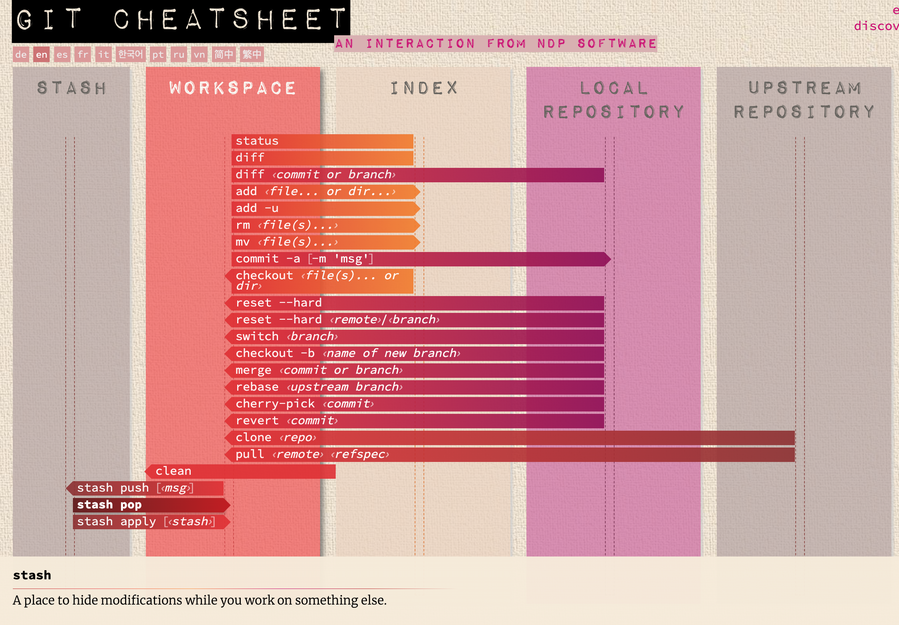

# Git

Git确实是太nb了，简单高效，加上github简直是如虎添翼，一统代码管理的天下，很长时间之内应该都不会有对手。每个IT人都必须熟练掌握git。

学习任何技术，最重要的是找到[官网](https://git-scm.com/)。

除去官网之外，列出其他一些重要的资源：
- [git Cheat Sheet](https://training.github.com/downloads/github-git-cheat-sheet/)
- [github上的官网training文档](https://github.com/githubtraining/training-manual/tree/main/docs)
- [一目了然的各个阶段和对应命令](https://ndpsoftware.com/git-cheatsheet.html)
- 更多的git文档阅读： https://github.com/dictcp/awesome-git 
- 重要的概念图1：
- 重要的概念图2：


## git 常用命令 - 日常
```python
>> git status
>> git log
# 查看提交日志
>> git reflog
# 查看所有命令的日志，用于恢复误删除的提交或分支
>> git show
# 查看提交的详细内容
>> git add folder or folder/files or '*.txt'
>> git add . 
# 当你有很多文件需要添加时，使用 git add . 可以一次性添加当前目录及其子目录下的所有修改和新增的文件，非常方便。
>> git commit -m "msg"
>> git commit -am "msg"
# -am 针对那些已track的文件,可以少一次使用git add命令
>> git diff
# 后面不带参数时，比较的是 workspace和Index之间的区别。
>> git diff --staged or --cached
# 比较的是 Index和local repository 之间的区别。
>> git diff --name-only or --name-status
# 此时精简的显示哪个文件有修改，仅此而已
```

## git 常用命令 - 初始化/远程
```python
>> git init
>> git clone url
>> git add .gitignore
# .gitignore 在github有模板，包含了很多文件，可以保证不该track的文件就不用track。
# 官方for Mac： https://github.com/github/gitignore/blob/main/Global/macOS.gitignore
# 官方for Windows: https://github.com/github/gitignore/blob/main/Global/Windows.gitignore
# 我当前使用的是廖雪峰的版本：
>> git remote -v
# 查看当前配置的远程仓库
>> git remote add origin https://github.com/abnceo/myGitsite.git
>> git push -u origin main
# 这里的-u参数是用来设置上游（跟踪）分支的，这样之后你可以简单地使用git push和git pull而不需要指定分支名。
>> git push
# 当运行过上面这句指令后，以后直接git push就可以将当前分支推送到远程仓库
>> git pull
# 每次编辑代码前，先从remote/origin 拉最新的代码，以保证编辑是在最新的代码之上。
>> git fetch
# 和git pull的区别是 - 这个是每次先拉取，但是没有自动merge
>> git config -l or --list
# 列出所有git config的项
>> git config --global http.proxy http://127.0.0.1:1087
>> git config --global https.proxy https://127.0.0.1:1087
>> git config --global http.https://github.com.proxy socks5://127.0.0.1:10808 
>> git config --global https.https://github.com.proxy socks5://127.0.0.1:10808
# 配合v2ray，以上4条是配置代理（端口号请具体查看V2ray的配置文件）。
# 之后使用命令行时候就可以走代理。但是vs code中的GUI的命令依然不会走代理。
```

## git 常用命令 - 分支合并及其他
```python
>> git branch
# 不带参数时，会列出当前所有的分支
>> git checkout [branch_name]
# 切换到指定的分支
>> git merge [branch_name]
# 将指定的分支合并到当前的分支
>> git reset
>> git revert [commit]
# 撤销指定提交的更改。
>> git checkout –[file]
# 恢复文件到最近一次提交的状态。
```