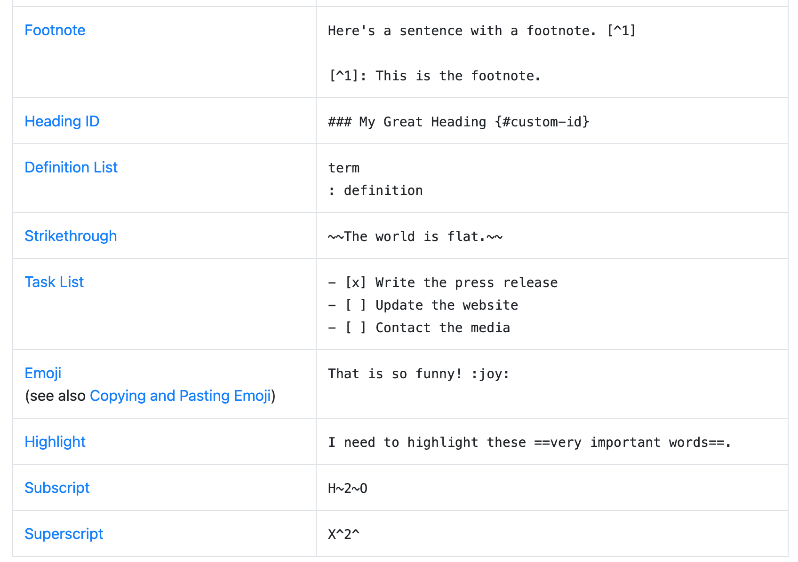

# MK Docs

#### 换行
在Markdown中，换行有三种基本方式：硬换行、软换行和标签换行。
1. 硬换行：在一行的末尾加上两个以上的空格，然后按下回车键即可实现硬换行。
2. 软换行：在两行文本之间加上一个空行即可实现软换行。
3. 标签换行：（适用于两行换行和一行换行），如果想要在一段文本中实现单行(或多行)换行，可以使用HTML的换行标签"\<br>"或"\</br>"或"\<br/>"。

#### 一些常用操作
- 转义字符 \
- 强制空格 \&nbsp;

#### Basic Syntax from [cheatsheet](https://www.markdownguide.org/cheat-sheet/#overview)
| Element | Markdown Syntax |
| ----------- | ----------- |
| Heading | # H1 <br> ## H2 <br> ### H3 <br>|
| Bold| **bold text** |
| Italic| *italicized text* |
| Blockquote| > blockquote|
| Ordered List| 1. First item <br> 2. Second item <br> 3. Third item |
| Unordered List|	- First item <br> - Second item <br> - Third item <br> |
| Code|	`code` |
| Horizontal Rule| --- |
| Link|	\[title](https://www.example.com) |
| Image	|\!\[alt text]\(image.jpg)|

#### Extended Syntax

These elements extend the basic syntax by adding additional features. Not all Markdown applications support these elements.

| Element | Markdown Syntax |
| ----------- | ----------- |
| Table | \| Syntax \| Description \| <br> \| ----------- \| ----------- \| <br> \| Header \| Title \|<br>\| Paragraph \| Text \| |
| Fenced Code Block | \``` <br> { <br>&nbsp;&nbsp;"firstName": "John",<br>&nbsp;&nbsp;"lastName": "Smith",<br>&nbsp;&nbsp;"age": 25<br>}<br>\```|


#### more


### Footnote

Here's a sentence with a footnote. [^1]

[^1]: This is the footnote.


### Strikethrough

~~The world is flat.~~

### Task List

- [x] Write the press release
- [ ] Update the website
- [ ] Contact the media